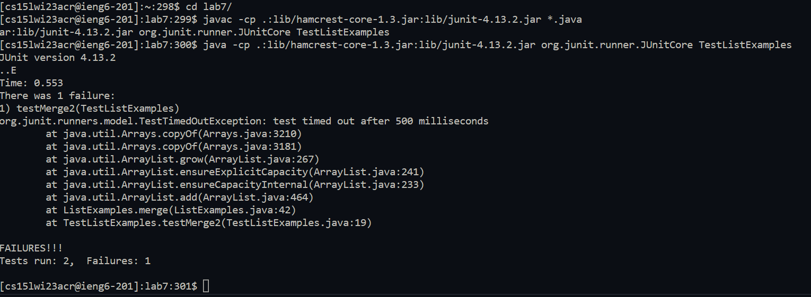
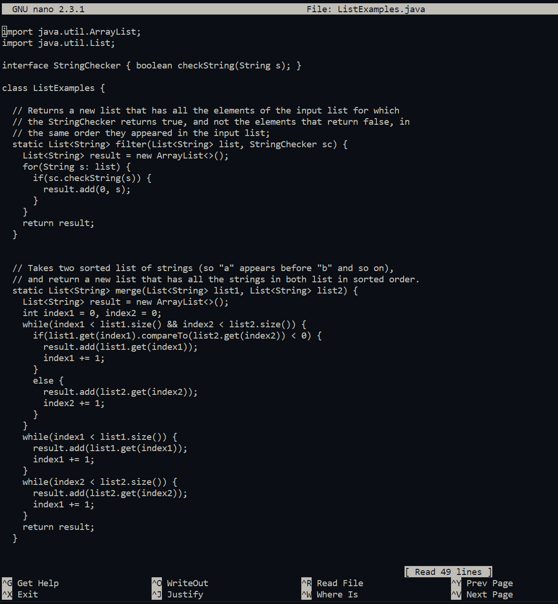
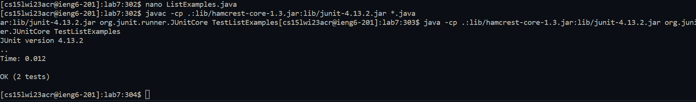
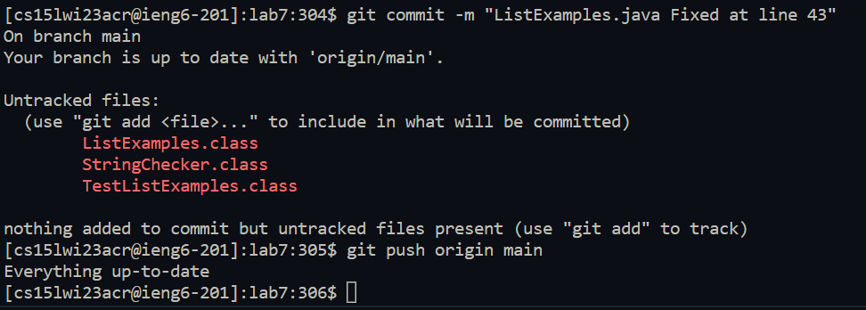

# Lab Report 4 - Challenge Tasks 
## Cameron Bishop
---
### First attempts
So, when beginning, the methods of optimization were a lot more within the obvious listed methods, using a lot of tab to complete and going through each task individually line by line.
The first step is always just logging in, and since the username to log in is not something that can easily be autocompleted, it has to be typed or copy pasted the first time.
Afterwards, you can just use the <code>&lt;up&gt;</code> and since it is the only command you execute locally for the challenge, it will be copied into the terminal faster than you would be able to.  

So, paste
<code>ssh cs15lwi23acr@ieng6.ucsd.edu</code>
And hit 
<code>&lt;enter&gt;</code>  
if your key is set up correctly this should log you in and print the standard server configuration and starting info
  

---

Next, you would clone the repository on git typing <code>git clo&lt;tab&gt;</code> then pasting in your ssh git URL mine being <code>git@github.com:bishopcam/lab7.git</code> 

 

---

Next, you run the tests on the incorrect version of ListExamples demonstrating that it fails

First, using cd to get into the file typing <code>cd la&lt;tab&gt;&lt;enter&gt;</code>

Then, run the commands to run the JUnit tests, by copy pasting from either the previous lab instructions or another place you have them saved, and be sure it is going to run TestListExamples

```
javac -cp .:lib/hamcrest-core-1.3.jar:lib/junit-4.13.2.jar *.java
java -cp .:lib/hamcrest-core-1.3.jar:lib/junit-4.13.2.jar org.junit.runner.JUnitCore TestListExamples
```
 

---
Next, to edit the code, you run nano on ListExamples

type <code>nano Li&lt;tab&gt;j&lt;tab&gt;</code>

Then, once in nano hit control w and search for the code <code>while(index2</code>, the closest unique aspect of a prior line before the error.

 

Then use the arrow keys to navigate to the 1 in index1 and change it to two. Then hit ctrl O enter, ctrl X to save the file and exit nano.

---

Next, Run the JUnit Tests again, and they should now succeed, using the same copy pasted of the commands from before. This time, they should all pass because you fixed the issue!
```
javac -cp .:lib/hamcrest-core-1.3.jar:lib/junit-4.13.2.jar *.java
java -cp .:lib/hamcrest-core-1.3.jar:lib/junit-4.13.2.jar org.junit.runner.JUnitCore TestListExamples
```
 

---
Now finally you can commit the files and then push the fixes to main. 
Copy paste a saved version of committing, because there is not much autocomplete optimization, and you would have to type out a commit message, mine looked like this <code>git commit -m "ListExamples.java Fixed at line 43"</code>  
Then, to push you type <code>git push o&lt;tab&gt; m&lt;tab&gt;</code>

 

### Final Optimizations 
Later, after  all of the group work, we made it so that using a command to replace, you no longer had to do the slowest step, editing in nano. Then, we learned you can copy paste multiple lines to run and bash will run them consecutively. So using these, all you have to do is log in, wait for the server to load, and paste in all the commands in order for the task so it will complete each step as soon as the previous is done.

First, copy paste (or up arrow on subsequent attempts) the ssh to log in as quicky as possible
```
ssh cs15lwi23acr@ieng6.ucsd.edu
```
Then, as quicky ass possible when logged in, enter all of the following commands by copy paste, so that they are all queued and ran in order.
```
git clone git@github.com:bishopcam/lab7.git 
cd lab7
javac -cp .:lib/hamcrest-core-1.3.jar:lib/junit-4.13.2.jar *.java
java -cp .:lib/hamcrest-core-1.3.jar:lib/junit-4.13.2.jar org.junit.runner.JUnitCore TestListExamples
sed -i '43 s/1/2/1' ListExamples.java
javac -cp .:lib/hamcrest-core-1.3.jar:lib/junit-4.13.2.jar *.java
java -cp .:lib/hamcrest-core-1.3.jar:lib/junit-4.13.2.jar org.junit.runner.JUnitCore TestListExamples
git add ListExamples.java
git commit -m "ListExamples.java"
git push origin main
```
by doing this we basically optimized out everything except the load time for logging into the server, then the runtime of all of the commands that are needed for the challenge. This basically ended up being around **9 seconds** long.

