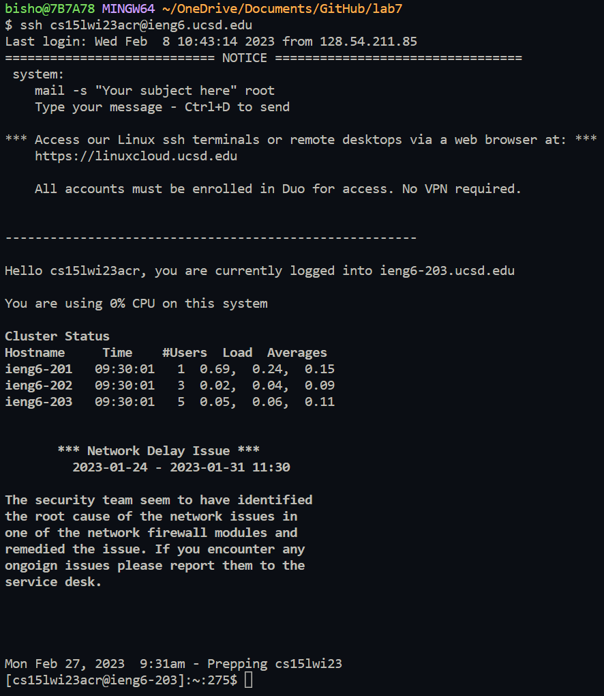
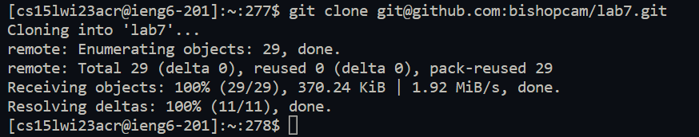

# Lab Report 4 - Challenge Tasks 
## Cameron Bishop
---
### First attempts
So, when beginning, the methods of optimization were a lot more within the obvious listed methods, using a lot of tab to complete and going through each task individually line by line.
The first step is always just logging in, and since the username to log in is not something that can easily be autocompleted, it has to be typed or copy pasted the first time.
Afterwards, you can just use the <code>&lt;up&gt;</code> and since it is the only command you execute locally for the challenge, it will be copied into the terminal faster than you would be able to.  

So, paste
<code>ssh cs15lwi23acr@ieng6.ucsd.edu</code>
And hit 
<code>&lt;enter&gt;</code>  
if your key is set up correctly this should log you in and print the standard server configuration and starting info
  

---

next you would clone the repository on git typing <code>git clo&lt;tab&gt;</code> then pasting in your ssh git URL mine being <code>git@github.com:bishopcam/lab7.git</code> 

 


### Final Optimizations 
First, copy paste (or up arrow on subsequent attempts) the ssh to log in as quicky as possible
```
ssh cs15lwi23acr@ieng6.ucsd.edu
```
Then, as quicky ass possible when logged in, enter all of the following commands by copy paste, so that they are all queued and ran in order.
```
git clone git@github.com:bishopcam/lab7.git 
cd lab7
javac -cp .:lib/hamcrest-core-1.3.jar:lib/junit-4.13.2.jar *.java
java -cp .:lib/hamcrest-core-1.3.jar:lib/junit-4.13.2.jar org.junit.runner.JUnitCore TestListExamples
sed -i '43 s/1/2/1' ListExamples.java
javac -cp .:lib/hamcrest-core-1.3.jar:lib/junit-4.13.2.jar *.java
java -cp .:lib/hamcrest-core-1.3.jar:lib/junit-4.13.2.jar org.junit.runner.JUnitCore TestListExamples
git add ListExamples.java
git commit -m "ListExamples.java"
git push origin main
```
by doing this we basically optimized out everything except the load time for logging into the server, then the runtime of all of the commands that are needed for the challenge. This basically ended up being around **9 seconds** long.

